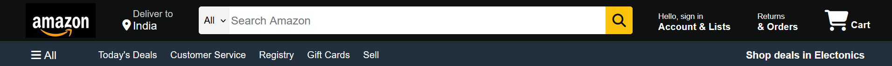
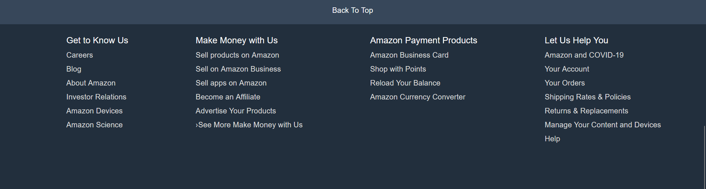
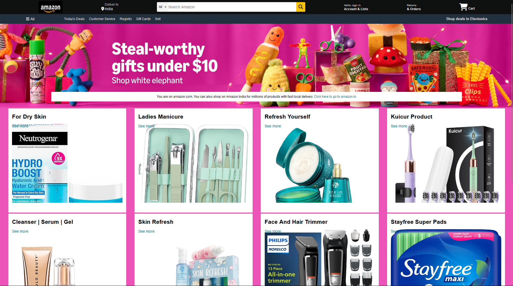

# Amazon Clone UI

This repository contains a user interface (UI) clone of Amazon.com website. The project is built using **HTML** and **CSS**, focusing on replicating the visual design without any backend functionality.

---

## **Project Overview**
- **Project Name**: Amazon Clone UI
- **Technologies Used**:
  - HTML
  - CSS
- **Purpose**: To practice front-end web development by replicating a popular e-commerce website's design.

---

## **Features**
- A styled **navigation bar**.
- A **product grid section** to display items.
- A simple **footer** section.

---

## **Screenshots**

### Navigation Bar


### Hero Section


### Product Grid Layout

 

### Footer Design



### Full Page Layout



---

## **How to Run the Project**
1. Clone the repository:
   ```bash
   git clone https://github.com/ShraddhaThakare801/Amazon-Clone-UI.git

1. Open the Amazon.html file in a browser.

---

## Future Enhancements
- Add Javascript for interactivity.
- Implement backend functionality using PHP
- Add responsiveness for better mobile compatibility

---

## Project Structure
The structure of the project is as follows:

```bash
Amazon-Clone-UI |---Amazon.html    # Main HTML file
|---MyStyle.css    # CSS for styling
|---Images         # Folder containing all image assests
|---ScreenShots    # Folder containing screenshots
|---README.md      # Documentation for the project


